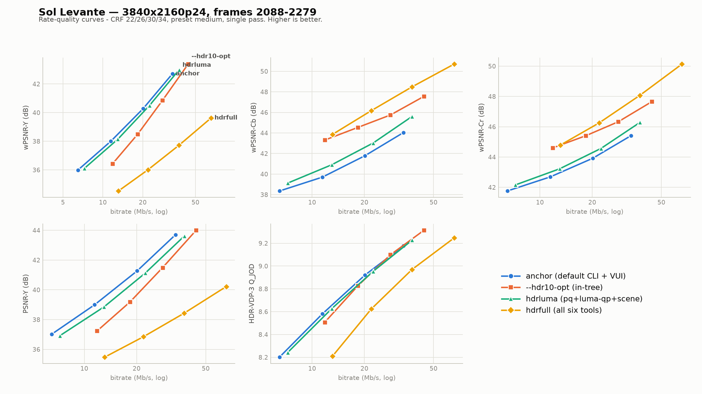
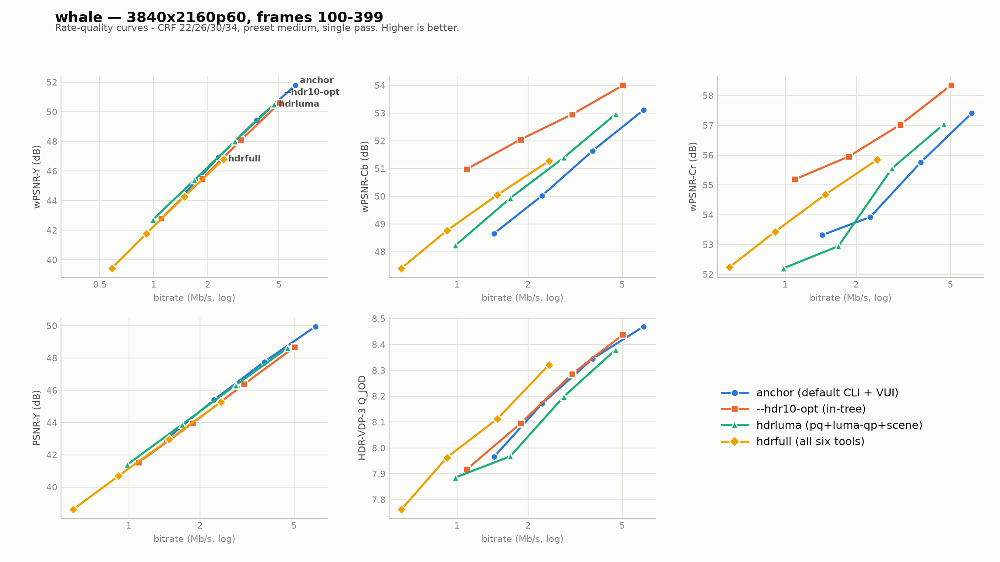

# HDR tools validation results — real HDR10 PQ content

Date: 2026-08-03 · Encoder: `HDR` branch @ `479426a59` (banding-protect fix
included) · Preset medium, CRF {22, 26, 30, 34}, single pass, 4 configs (incl. --hdr10-opt baseline) ·
Metrics: JVET-CTC wPSNR, HDR-VDP-3.0.7 (Q_JOD, 4 frames/encode,
1920x1080 center crop, 62 ppd). See [README.md](README.md) for setup.

## Rate-quality curves — all metrics, all configurations

How to read them: a curve up-and-left of another wins BD-rate. On **whale**,
hdrluma (aqua) sits on top of the anchor (blue) in wPSNR-Y — the −0.8%
BD-rate — while both hdr10-opt (orange) and hdrfull (yellow) fall below.
On **Sol Levante**, hdr10-opt and hdrfull shift right (more bits for the
same luminance quality) but dominate the chroma panels, where hdrluma also
beats the anchor throughout. The Q_JOD panels show all four configs within
a narrow band on Sol Levante (hdr10-opt slightly on top at extra rate).
Regenerate with `python plot_results.py` (matplotlib, reads `results.json`).

## Headline BD-rates vs anchor (negative = bits saved at equal quality)

| Clip | Config | PSNR-Y | wPSNR-Y | wPSNR-Cb | wPSNR-Cr |
|---|---|---:|---:|---:|---:|
| Sol Levante | hdr10opt (in-tree) | +42.4% | +33.1% | −56.3% | −49.6% |
| Sol Levante | hdrluma | +15.8% | +7.3% | **−18.7%** | **−12.8%** |
| Sol Levante | hdrfull | +286% | +255% | **−59.3%** | **−51.5%** |
| whale | hdr10opt (in-tree) | +9.0% | +6.4% | −56.3% | −49.4% |
| whale | hdrluma | +1.4% | **−0.8%** | **−21.1%** | **−11.5%** |
| whale | hdrfull | +6.8% | +6.7% | **−35.3%** | **−48.5%** |

### vs x265's existing `--hdr10-opt`

`hdr10opt` = the anchor command + `--hdr10-opt` (the in-tree fixed JCTVC
luma-dQP staircase + slice-level chroma offsets). Compared against it, the
HDR-branch `hdrluma` set achieves its luminance goal far more cheaply:
wPSNR-Y BD-rate +7.3% vs +33.1% (Sol Levante) and **−0.8% vs +6.4%**
(whale). `--hdr10-opt` trades luma for chroma much more aggressively
(−50..−56% chroma wPSNR BD-rate, similar to the six-tool `hdrfull` stack).
On HDR-VDP-3, `hdr10opt` posts the highest Q_JOD per CRF on Sol Levante
(9.31 at CRF22 vs 9.23 hdrluma / 9.18 anchor) but at ~31% more bits; on
whale its Q_JOD tracks slightly below anchor at each CRF at ~18% fewer
bits. In short: the continuous `--hdr-luma-qp` model is a strictly milder,
tunable version of the `--hdr10-opt` trade, and `--hdr-chroma-qp` /
`--hdr-scaling-list` reproduce the aggressive chroma end of it when
explicitly requested.

HDR-VDP-3 BD-rates are not tabulated: with 4 sampled frames per encode the
Q_JOD spread between configs (0.02–0.09 JOD) is within sampling noise and
the Bjøntegaard fit amplifies it into meaningless percentages. Per-CRF
Q_JOD means are in the raw tables below; the consistent observations are:
Sol Levante hdrluma scores **above** anchor at every CRF (+0.03..+0.05
JOD at ~12% more bits); whale hdrluma scores slightly below anchor at
each CRF while spending ~25% fewer bits.

## Reading

- **hdr-pq + hdr-luma-qp + hdr-scene-qp (`hdrluma`)** is roughly
  wPSNR-Y-neutral on natural content (−0.8% on whale, a real if small
  BD-rate win; +7.3% on the anime clip, a loss) and delivers **large,
  consistent chroma wPSNR gains** (−11..−21% BD-rate) from the BT.2020
  chroma QP offsets. The luma-adaptive dQP model redistributes bits
  toward bright regions exactly as the JVET CTC model prescribes; on
  content whose brightness distribution doesn't match the model's
  assumptions (dark anime), it costs luma BD-rate.
- **The full stack (`hdrfull`)** is expensive on luminance metrics *by
  construction* — `--hdr-scaling-list` relaxes high-frequency
  quantization and `--hdr-chroma-qp` moves bits from luma to chroma;
  both are documented as subjective tools. The chroma wPSNR gains are
  correspondingly very large (−35..−59%).
- **`--hdr-scene-qp`** was near-inert (+0.04 dB wPSNR-Y, +1% bits) on
  these steady-state segments, as designed — its trigger is transient
  brightness deviation, which the Sol Levante segment's single hard cut
  correctly re-baselines instead of biasing.

## Single-tool ablation (whale, CRF 22, 48 frames)

| Tool (alone, strength 1.0) | kbps | Δ wPSNR-Y | Δ wPSNR-Cb | Δ wPSNR-Cr |
|---|---:|---:|---:|---:|
| anchor | 6837 | — | — | — |
| --hdr-pq | 7068 | +0.01 | +0.77 | +0.80 |
| --hdr-luma-qp 1.0 | 4977 | −1.96 | −1.36 | −1.41 |
| --hdr-banding-protect 1.0 (fixed) | 4060 | −4.15 | −2.07 | −1.36 |
| --hdr-banding-protect 1.0 (pre-fix) | 8067 | **−16.6** | −5.4 | −1.4 |
| --hdr-scene-qp 1.0 | 6916 | +0.04 | +0.03 | +0.05 |

## Validation caught a real bug

The first sweep produced non-overlapping RD curves: the HDR configs lost
10–16 dB PSNR-Y while spending **more** bits, traced to
`--hdr-banding-protect` multiplying the raw `-log2(acEnergy)` term
(≈ −20 for typical blocks) by the 1.0-vs-0.2 luma-range gate — the gate,
not flatness, dominated the zero-meaned signal, producing per-block QP
offsets of ±60..80. Fixed in `479426a59` by gating the clamped flatness
*deviation* (max ±6 QP at strength 1.0). The pre-fix ablation row above
shows the failure signature.

## Caveats

- Two clips, one segment each (192 / 300 frames). No animation-vs-natural
  generalization should be drawn from n=1 per class.
- HDR-VDP-3 sampled at 4 frames/encode on a 1080p center crop; treat
  Q_JOD deltas < ~0.1 as noise.
- `hdr-scene-qp` needs content with brightness transients (flashes,
  strobes) for a meaningful test; these segments barely exercise it.
- All strengths were 1.0; no strength sweep was performed.

## Raw rate-quality tables

kbps | PSNR-Y | wPSNR-Y | wPSNR-Cb | wPSNR-Cr | Q_JOD

### Sol Levante (3840x2160p24, frames 2088–2279)

| Config | CRF22 | CRF26 | CRF30 | CRF34 |
|---|---|---|---|---|
| anchor | 33493 \| 43.71 \| 42.71 \| 44.03 \| 45.42 \| 9.18 | 20121 \| 41.27 \| 40.28 \| 41.78 \| 43.92 \| 8.92 | 11466 \| 39.00 \| 38.00 \| 39.70 \| 42.69 \| 8.58 | 6487 \| 37.02 \| 35.99 \| 38.35 \| 41.76 \| 8.20 |
| hdr10opt | 44035 \| 44.01 \| 43.39 \| 47.56 \| 47.66 \| 9.31 | 28219 \| 41.49 \| 40.86 \| 45.75 \| 46.33 \| 9.10 | 18342 \| 39.19 \| 38.50 \| 44.54 \| 45.41 \| 8.83 | 11834 \| 37.23 \| 36.43 \| 43.31 \| 44.60 \| 8.51 |
| hdrluma | 37643 \| 43.62 \| 43.00 \| 45.61 \| 46.29 \| 9.23 | 22467 \| 41.14 \| 40.49 \| 43.03 \| 44.57 \| 8.95 | 12985 \| 38.86 \| 38.15 \| 40.91 \| 43.22 \| 8.63 | 7237 \| 36.92 \| 36.10 \| 39.12 \| 42.16 \| 8.24 |
| hdrfull | 65670 \| 40.22 \| 39.63 \| 50.70 \| 50.14 \| 9.25 | 37600 \| 38.44 \| 37.73 \| 48.49 \| 48.07 \| 8.97 | 21910 \| 36.85 \| 36.01 \| 46.17 \| 46.25 \| 8.62 | 13101 \| 35.48 \| 34.53 \| 43.86 \| 44.79 \| 8.21 |

### whale (3840x2160p60, frames 100–399)

| Config | CRF22 | CRF26 | CRF30 | CRF34 |
|---|---|---|---|---|
| anchor | 6159 \| 49.96 \| 51.79 \| 53.11 \| 57.41 \| 8.47 | 3744 \| 47.77 \| 49.45 \| 51.64 \| 55.76 \| 8.35 | 2292 \| 45.41 \| 46.92 \| 50.02 \| 53.93 \| 8.17 | 1435 \| 42.95 \| 44.31 \| 48.66 \| 53.32 \| 7.97 |
| hdr10opt | 5032 \| 48.69 \| 50.59 \| 54.00 \| 58.34 \| 8.44 | 3071 \| 46.38 \| 48.10 \| 52.96 \| 57.02 \| 8.29 | 1860 \| 43.95 \| 45.47 \| 52.05 \| 55.96 \| 8.10 | 1099 \| 41.52 \| 42.81 \| 50.98 \| 55.19 \| 7.92 |
| hdrluma | 4699 \| 48.63 \| 50.50 \| 52.97 \| 57.04 \| 8.38 | 2831 \| 46.32 \| 48.01 \| 51.39 \| 55.56 \| 8.20 | 1681 \| 43.89 \| 45.39 \| 49.93 \| 52.95 \| 7.97 | 986 \| 41.40 \| 42.71 \| 48.23 \| 52.21 \| 7.89 |
| hdrfull | 2451 \| 45.27 \| 46.80 \| 51.27 \| 55.85 \| 8.32 | 1482 \| 42.96 \| 44.28 \| 50.05 \| 54.68 \| 8.11 | 906 \| 40.70 \| 41.77 \| 48.76 \| 53.43 \| 7.96 | 582 \| 38.62 \| 39.44 \| 47.40 \| 52.24 \| 7.76 |

Raw per-encode numbers: [results.json](results.json) · BD-rates: [bd.json](bd.json)

---

# 2026-08-05 — post-rebase sweep: `--hdr-wsse-rd` strengths, `--hdr-deblock`, and the `--hdr-pq` floor

Re-anchored sweep after the rebase onto v4.3 master (encoder binary changed;
all configs re-encoded, same segments and CRF ladder as above). New tools
under test: `--hdr-wsse-rd` (wSSE-weighted RDO, per-CTU lambda scale) at
strengths 0.5/1.0/1.5 and `--hdr-deblock 1.0` (luma-adaptive slice deblock
offsets). A `hdrpq` config (`--hdr-pq` alone) was added to decompose the
tool-set results into "the `--hdr-pq` floor" vs "what each luma tool adds".

Note on content: measured APL says the segment labels were misleading —
`whale10` is dark throughout (APL 108–131 of 1023), `sol10` opens bright
(APL ~595) and cuts to dark (~185). Interpretations below use the measured
APL, not the folklore.

## BD-rate vs anchor (%, negative = better)

| clip | config | PSNR-Y | wPSNR-Y | wPSNR-Cb | wPSNR-Cr |
|---|---|---|---|---|---|
| sol10 | hdrpq | +7.14 | +7.14 | −18.81 | −19.53 |
| sol10 | hdrluma | +15.80 | +7.34 | −18.67 | −12.83 |
| sol10 | wsse05 | +7.51 | +6.82 | −18.69 | −18.18 |
| sol10 | wsse10 | +8.49 | +7.01 | −18.27 | −15.86 |
| sol10 | wsse15 | +10.43 | +7.84 | −16.69 | −12.28 |
| sol10 | dbk10 | +7.33 | +7.33 | −18.66 | −19.42 |
| whale10 | hdrpq | +1.38 | +1.37 | −17.49 | −22.92 |
| whale10 | hdrluma | +1.36 | −0.81 | −21.11 | −11.54 |
| whale10 | wsse05 | +3.58 | +2.90 | −15.72 | −20.10 |
| whale10 | wsse10 | +8.11 | +6.78 | −11.94 | −19.70 |
| whale10 | wsse15 | +15.59 | +13.47 | −7.48 | −17.39 |
| whale10 | dbk10 | +0.48 | +0.63 | −17.65 | −22.78 |

## Findings

1. **The "+7.3% dark-anime luma regression" was misattributed.** The
   `hdrpq` floor alone costs +7.14% wPSNR-Y on sol10; `hdrluma` (floor +
   luma-qp + scene-qp) costs +7.34%. The JVET luma-dQP model contributes
   ~+0.2% on sol10 — noise — and **gains −2.2%** on whale10 relative to the
   floor (−0.81 vs +1.37). The luma cost of the 2026-08 hdrluma result is
   almost entirely `--hdr-pq`'s fixed −2/−2 chroma QP offsets moving bits
   from luma to chroma (the same bits that buy the −12..−23% chroma
   BD-gains). That is an allocation choice, not a luma-model defect — JVET
   CTC reports Y/Cb/Cr separately for exactly this reason. The
   "content-adaptive luma-dQP re-centering" TODO item was aimed at the
   wrong culprit; if anything should adapt to dark content, it is the
   chroma offsets.

2. **wSSE-weighted RDO as a pure lambda scale is metric-counterproductive,
   and the damage grows with strength.** Relative to the `hdrpq` floor:
   whale10 +1.5/+5.4/+12.1% wPSNR-Y at strengths 0.5/1.0/1.5; sol10
   −0.3/−0.1/+0.7%. whale10 is the clean experiment: with APL ~120 the
   dQP clips to −3 nearly everywhere, so the tool applies a *uniform*
   lambda scale with the quantizer step unchanged — and a lambda that no
   longer matches the quantizer step moves every block off the R-D hull
   (RDOQ/mode decisions prune or keep coefficients against a q-step the
   lambda no longer describes). The per-QG **QP-domain** tool
   (`--hdr-luma-qp`) moves quantizer and lambda together, stays on-hull,
   and actually delivers the wPSNR gain the lambda tool was hoping for.
   Verdict: keep `--hdr-wsse-rd` as an off-by-default experiment; do not
   pursue as implemented. Any future wSSE work should weight *distortion
   in mode decision only* (leaving RDOQ lambda alone) or pair the weight
   with a matching per-QG QP offset — i.e. converge back to
   `--hdr-luma-qp`.

3. **`--hdr-deblock 1.0` is metric-neutral-to-slightly-positive** (+0.19
   on sol10, −0.74 on whale10 vs floor; the whale10 headers carry +2..+3
   beta/tc offsets throughout given its low APL). It does what it was
   designed to do without costing the objective metrics; its actual value
   (dark-scene blocking visibility) needs the subjective pass.

4. **Chroma gains belong to `--hdr-pq`**, confirmed: the floor alone shows
   −17..−23% chroma BD-rate; every tool stack inherits them.

## Caveats

- Same two-segment corpus as 2026-08; n=1 per content class.
- No HDR-VDP-3 this round (wPSNR/PSNR only); the 2026-08 caveat about
  Q_JOD sampling noise stands.
- whale10's hdrluma chroma numbers differ from the floor's (−21.1/−11.5 vs
  −17.5/−22.9): luma-qp's per-QG offsets shift the chroma QP mapping as a
  side effect; not investigated further.

## Raw rate-quality tables (kbps | PSNR-Y | wPSNR-Y | wPSNR-Cb | wPSNR-Cr)

### Sol Levante (3840x2160p24, frames 2088–2279)

| Config | CRF22 | CRF26 | CRF30 | CRF34 |
|---|---|---|---|---|
| anchor | 33493 \| 43.70 \| 42.71 \| 44.03 \| 45.42 | 20121 \| 41.27 \| 40.28 \| 41.78 \| 43.92 | 11466 \| 39.00 \| 38.00 \| 39.70 \| 42.69 | 6487 \| 37.02 \| 35.99 \| 38.35 \| 41.76 |
| hdrpq | 36027 \| 43.71 \| 42.72 \| 45.48 \| 46.39 | 21490 \| 41.28 \| 40.28 \| 42.86 \| 44.67 | 12393 \| 39.01 \| 38.01 \| 40.73 \| 43.30 | 6966 \| 37.03 \| 36.00 \| 39.05 \| 42.24 |
| hdrluma | 37643 \| 43.62 \| 43.00 \| 45.61 \| 46.29 | 22467 \| 41.13 \| 40.49 \| 43.03 \| 44.57 | 12985 \| 38.86 \| 38.15 \| 40.91 \| 43.22 | 7237 \| 36.92 \| 36.10 \| 39.12 \| 42.16 |
| wsse05 | 36131 \| 43.71 \| 42.74 \| 45.49 \| 46.36 | 21561 \| 41.28 \| 40.31 \| 42.86 \| 44.63 | 12408 \| 39.00 \| 38.03 \| 40.73 \| 43.27 | 6972 \| 37.02 \| 36.02 \| 39.05 \| 42.20 |
| wsse10 | 36242 \| 43.68 \| 42.74 \| 45.48 \| 46.31 | 21624 \| 41.25 \| 40.31 \| 42.85 \| 44.57 | 12437 \| 38.98 \| 38.03 \| 40.72 \| 43.21 | 6974 \| 36.98 \| 36.01 \| 39.04 \| 42.13 |
| wsse15 | 36371 \| 43.62 \| 42.72 \| 45.44 \| 46.22 | 21685 \| 41.19 \| 40.30 \| 42.80 \| 44.49 | 12467 \| 38.91 \| 38.01 \| 40.65 \| 43.12 | 6960 \| 36.91 \| 35.98 \| 38.98 \| 42.02 |
| dbk10 | 36018 \| 43.71 \| 42.71 \| 45.48 \| 46.39 | 21507 \| 41.27 \| 40.28 \| 42.86 \| 44.67 | 12404 \| 39.01 \| 38.01 \| 40.72 \| 43.30 | 6975 \| 37.02 \| 36.00 \| 39.04 \| 42.23 |

### whale (3840x2160p60, frames 100–399)

| Config | CRF22 | CRF26 | CRF30 | CRF34 |
|---|---|---|---|---|
| anchor | 6159 \| 49.96 \| 51.79 \| 53.11 \| 57.41 | 3744 \| 47.77 \| 49.45 \| 51.64 \| 55.76 | 2292 \| 45.41 \| 46.92 \| 50.02 \| 53.93 | 1435 \| 42.95 \| 44.31 \| 48.66 \| 53.32 |
| hdrpq | 6295 \| 49.96 \| 51.79 \| 53.72 \| 58.21 | 3805 \| 47.78 \| 49.46 \| 52.26 \| 56.49 | 2323 \| 45.41 \| 46.93 \| 50.72 \| 55.03 | 1445 \| 42.93 \| 44.29 \| 49.16 \| 53.59 |
| hdrluma | 4699 \| 48.63 \| 50.50 \| 52.97 \| 57.04 | 2831 \| 46.32 \| 48.01 \| 51.39 \| 55.56 | 1681 \| 43.89 \| 45.39 \| 49.93 \| 52.95 | 986 \| 41.40 \| 42.71 \| 48.23 \| 52.21 |
| wsse05 | 6005 \| 49.72 \| 51.56 \| 53.58 \| 58.09 | 3601 \| 47.43 \| 49.12 \| 52.09 \| 56.24 | 2185 \| 44.97 \| 46.50 \| 50.42 \| 54.81 | 1361 \| 42.46 \| 43.80 \| 48.86 \| 52.68 |
| wsse10 | 5683 \| 49.36 \| 51.22 \| 53.36 \| 57.88 | 3400 \| 46.96 \| 48.65 \| 51.82 \| 56.04 | 2062 \| 44.44 \| 45.95 \| 50.07 \| 54.61 | 1307 \| 41.82 \| 43.13 \| 48.37 \| 52.62 |
| wsse15 | 5349 \| 48.82 \| 50.69 \| 53.11 \| 57.63 | 3178 \| 46.32 \| 48.01 \| 51.47 \| 55.77 | 1952 \| 43.75 \| 45.23 \| 49.63 \| 54.29 | 1266 \| 41.12 \| 42.35 \| 47.89 \| 52.25 |
| dbk10 | 6286 \| 50.00 \| 51.83 \| 53.71 \| 58.19 | 3798 \| 47.82 \| 49.49 \| 52.28 \| 56.48 | 2322 \| 45.44 \| 46.96 \| 50.73 \| 55.02 | 1445 \| 42.99 \| 44.34 \| 49.12 \| 53.59 |

Pre-rebase numbers: [results-2026-08-03-prerebase.json](results-2026-08-03-prerebase.json)

# 2026-08-05 (late) — `--hdr-luma-qp` strength sweep and `--hdr-chroma-adapt`

Same segments, CRF ladder and metric pipeline as above. Two questions from
the agreed plan: (1) what is the BD-optimal `--hdr-luma-qp` strength when
the model is measured *pure* (`lumaqNN` configs = anchor VUI + strength,
**no** `--hdr-pq`, so nothing rides on the +7% chroma-offset floor)?
(2) does the new `--hdr-chroma-adapt` (per-frame scaling of the `--hdr-pq`
−2/−2 offsets by the chroma share of frame AC energy, `862809aed`) cut the
sol10 floor cost below the +3% target without giving up whale10's chroma
gains? Encodes for `chromaadapt` used the post-`862809aed` binary; the
lumaq/anchor encodes predate it (verified bit-identical default paths).

## BD-rate vs anchor (%, negative = better)

| clip | config | PSNR-Y | wPSNR-Y | wPSNR-Cb | wPSNR-Cr |
|---|---|---|---|---|---|
| sol10 | lumaq025 | +0.77 | −0.94 | −0.11 | +0.51 |
| sol10 | lumaq05 | +2.21 | **−1.31** | +0.36 | +1.50 |
| sol10 | lumaq075 | +4.36 | −1.03 | +0.97 | +3.01 |
| sol10 | lumaq10 | +7.26 | −0.12 | +2.08 | +5.15 |
| sol10 | lumaq15 | +15.02 | +3.35 | +5.41 | +10.28 |
| sol10 | chromaadapt | +1.19 | **+1.19** | −2.68 | −5.85 |
| whale10 | lumaq025 | +0.43 | −0.26 | −1.54 | +6.73 |
| whale10 | lumaq05 | −0.22 | −1.50 | −2.22 | +1.31 |
| whale10 | lumaq075 | −0.07 | −1.81 | −3.05 | −2.25 |
| whale10 | lumaq10 | +0.08 | **−2.08** | −2.98 | −3.94 |
| whale10 | lumaq15 | +2.13 | −0.74 | −0.16 | +10.53 |
| whale10 | chromaadapt | +1.38 | +1.38 | −17.48 | −22.91 |

(Reference for chromaadapt: the `hdrpq` floor is +7.14 wPSNR-Y on sol10 and
+1.37 on whale10, chroma −17..−23 on both — table in the section above.)

## Findings

1. **The pure JVET luma-dQP model gains on BOTH clips** — including the
   dark anime that motivated the whole floor investigation: sol10 −1.31%,
   whale10 −1.50% wPSNR-Y at strength 0.5. There is no dark-content penalty
   in the luma model itself; the 2026-08 "+7.3%" was entirely the floor.
2. **BD-optimal strength is a 0.5–0.75 plateau; recommend 0.5.** Means
   across clips: 0.25 → −0.60, 0.5 → −1.41, 0.75 → −1.42, 1.0 → −1.10,
   1.5 → +1.31. The 0.5/0.75 means are statistically tied; 0.5 has the
   smaller chroma side-costs on sol10 (+0.4/+1.5 vs +1.0/+3.0 Cb/Cr) and
   is never worse than −0.9 on either clip. 1.0 (the untested default we
   had been using) already gives back most of sol10's gain; 1.5 overdrives
   both clips. Docs updated to recommend 0.5–0.75.
3. **`--hdr-chroma-adapt 1.0` meets its target.** sol10's floor cost drops
   +7.14 → **+1.19% wPSNR-Y** (target was < +3%), and whale10 is
   numerically indistinguishable from the plain floor (+1.38 vs +1.37
   wPSNR-Y; chroma −17.5/−22.9 fully retained) — the share mapping held
   factor 1.0 on every whale10 frame, exactly as designed. On sol10 most
   of the chroma gain is (correctly) given back (−2.7/−5.9 remains of
   −18.8/−19.5): those gains were being bought at +7% luma on content
   whose chroma carries up to 40% of the AC energy. The exchange rate
   improves from ~2.7% chroma-gain per 1% luma-cost to ~7% per 1%.
4. **Composability caveat**: chromaadapt was measured alone on the floor.
   The natural production set is now `--hdr-pq --hdr-chroma-adapt 1.0
   --hdr-luma-qp 0.5 --hdr-scene-qp 1.0`; that stack has not been measured
   as a unit yet.

## Raw rate-quality tables (kbps | PSNR-Y | wPSNR-Y | wPSNR-Cb | wPSNR-Cr)

### Sol Levante (3840x2160p24, frames 2088–2279)

| Config | CRF22 | CRF26 | CRF30 | CRF34 |
|---|---|---|---|---|
| lumaq025 | 33950 \| 43.74 \| 42.83 \| 44.12 \| 45.45 | 20337 \| 41.29 \| 40.37 \| 41.83 \| 43.93 | 11600 \| 39.00 \| 38.07 \| 39.74 \| 42.70 | 6534 \| 37.02 \| 36.04 \| 38.38 \| 41.77 |
| lumaq05 | 34504 \| 43.76 \| 42.93 \| 44.22 \| 45.47 | 20640 \| 41.29 \| 40.46 \| 41.86 \| 43.95 | 11775 \| 39.00 \| 38.14 \| 39.78 \| 42.70 | 6620 \| 37.01 \| 36.09 \| 38.38 \| 41.76 |
| lumaq075 | 35113 \| 43.76 \| 43.02 \| 44.30 \| 45.48 | 20960 \| 41.27 \| 40.53 \| 41.88 \| 43.95 | 11997 \| 38.98 \| 38.19 \| 39.83 \| 42.71 | 6732 \| 37.01 \| 36.13 \| 38.40 \| 41.77 |
| lumaq10 | 35869 \| 43.74 \| 43.09 \| 44.36 \| 45.50 | 21385 \| 41.24 \| 40.58 \| 41.90 \| 43.96 | 12279 \| 38.95 \| 38.23 \| 39.89 \| 42.71 | 6876 \| 37.00 \| 36.17 \| 38.42 \| 41.75 |
| lumaq15 | 37574 \| 43.64 \| 43.20 \| 44.40 \| 45.50 | 22462 \| 41.14 \| 40.65 \| 41.97 \| 43.97 | 12985 \| 38.89 \| 38.30 \| 40.00 \| 42.72 | 7240 \| 36.99 \| 36.25 \| 38.42 \| 41.75 |
| chromaadapt | 33922 \| 43.71 \| 42.71 \| 44.22 \| 45.62 | 20351 \| 41.27 \| 40.28 \| 41.93 \| 44.09 | 11616 \| 39.00 \| 38.00 \| 39.83 \| 42.84 | 6574 \| 37.02 \| 36.00 \| 38.45 \| 41.90 |

### whale (3840x2160p60, frames 100–399)

| Config | CRF22 | CRF26 | CRF30 | CRF34 |
|---|---|---|---|---|
| lumaq025 | 5718 \| 49.64 \| 51.48 \| 52.89 \| 57.10 | 3482 \| 47.41 \| 49.10 \| 51.40 \| 55.50 | 2137 \| 45.03 \| 46.55 \| 49.96 \| 53.40 | 1333 \| 42.52 \| 43.88 \| 48.33 \| 52.90 |
| lumaq05 | 5298 \| 49.31 \| 51.17 \| 52.67 \| 56.77 | 3222 \| 47.05 \| 48.75 \| 51.21 \| 55.27 | 1955 \| 44.62 \| 46.15 \| 49.68 \| 53.30 | 1191 \| 42.13 \| 43.48 \| 47.78 \| 52.46 |
| lumaq075 | 4928 \| 48.97 \| 50.83 \| 52.43 \| 56.48 | 2999 \| 46.69 \| 48.39 \| 51.02 \| 54.94 | 1811 \| 44.25 \| 45.77 \| 49.45 \| 53.57 | 1089 \| 41.74 \| 43.09 \| 47.84 \| 51.80 |
| lumaq10 | 4596 \| 48.61 \| 50.48 \| 52.20 \| 56.17 | 2783 \| 46.31 \| 48.01 \| 50.78 \| 54.73 | 1657 \| 43.84 \| 45.34 \| 49.18 \| 53.35 | 979 \| 41.37 \| 42.68 \| 47.40 \| 51.85 |
| lumaq15 | 4025 \| 47.89 \| 49.76 \| 51.77 \| 55.80 | 2422 \| 45.52 \| 47.19 \| 50.19 \| 54.01 | 1424 \| 43.11 \| 44.57 \| 48.73 \| 53.27 | 809 \| 40.68 \| 41.91 \| 47.76 \| 51.70 |
| chromaadapt | 6295 \| 49.96 \| 51.79 \| 53.72 \| 58.21 | 3805 \| 47.78 \| 49.46 \| 52.26 \| 56.49 | 2323 \| 45.41 \| 46.93 \| 50.72 \| 55.03 | 1445 \| 42.93 \| 44.29 \| 49.16 \| 53.59 |

## Caveats

- Same two-segment corpus; n=1 per content class. The chroma-share mapping
  thresholds [0.10, 0.30] are calibrated on exactly these two clips — a
  mid-share clip (0.1–0.3) would exercise the interpolated region for the
  first time.
- wPSNR/PSNR only this round; no HDR-VDP-3.
- chromaadapt measured on the floor only; the combined production stack
  (floor + chroma-adapt + luma-qp 0.5 + scene-qp) is unmeasured.

# 2026-08-05 (late-2) — production stack, `--hdr-chroma-adapt` strengths, and CAMBI on a banding segment

Three questions: (1) does the recommended production stack (`--hdr-pq
--hdr-chroma-adapt 1.0 --hdr-luma-qp 0.5 --hdr-scene-qp 1.0`, `prodstack`)
hold up measured as a unit? (2) is 1.0 the right `--hdr-chroma-adapt`
strength? (3) with CAMBI finally in the harness (`cambi.py`, libvmaf via
ffmpeg) and a dedicated gradient-heavy PQ segment (`band10`,
`gen_band10.py`), does `--hdr-banding-protect` actually reduce banding, and
does `--hdr-scaling-list` affect it?

The `band10` segment is synthetic sunset-sky gradients built in linear
light and TPDF-dithered to 10 bits like a real master. The dither matters:
undithered, the source itself scored CAMBI ≈ 4.0 and a CRF34 encode scored
*lower* than the source. Dithered, source CAMBI is 0.005 and every encode
bands (~3.2–3.7).

## BD-rate vs anchor (%, negative = better)

| clip | config | PSNR-Y | wPSNR-Y | wPSNR-Cb | wPSNR-Cr |
|---|---|---|---|---|---|
| sol10 | chromaadapt05 | +4.08 | +4.09 | −11.14 | −13.83 |
| sol10 | chromaadapt (1.0) | +1.19 | +1.19 | −2.68 | −5.85 |
| sol10 | chromaadapt15 | +0.70 | +0.71 | −1.47 | −4.19 |
| sol10 | **prodstack** | +3.90 | **−0.16** | −2.85 | −2.35 |
| whale10 | **prodstack** | +0.90 | **−0.26** | −19.59 | −20.59 |
| band10 | bandp05 | +8.94 | +9.15 | +5.81 | +7.72 |
| band10 | bandp10 | +21.55 | +22.57 | +16.62 | +19.93 |
| band10 | slist | −0.39 | −0.23 | −0.52 | −0.15 |

## CAMBI on band10 (mean over 96 frames; 0 = none, ≳5 = clearly visible)

| config | CRF22 | CRF26 | CRF30 | CRF34 |
|---|---|---|---|---|
| source | 0.005 | | | |
| anchor | 3.64 | 3.37 | 3.46 | 3.25 |
| bandp05 | 3.68 | 3.43 | 3.22 | 3.29 |
| bandp10 | 3.58 | 3.46 | 3.46 | 3.16 |
| slist | 3.63 | 3.44 | 3.49 | 3.26 |

p95 is pinned at 3.72–3.88 for every config and CRF. Control encodes at
CRF 12/16 (not in results.json) scored CAMBI mean 3.95/3.86 — *higher*
than CRF 34, and converging on the **undithered** source's 4.0.

## Findings

1. **The production stack works measured as a unit: recommend it.**
   wPSNR-Y −0.16% (sol10) / −0.26% (whale10) vs anchor — luma-neutral on
   the clip class where the plain floor costs +7.14% — while keeping
   whale10's full chroma gains (−19.6/−20.6) and a residual −2.9/−2.4 on
   sol10. The stack is strictly better than `--hdr-pq` alone on every
   metric column of both clips.
2. **`--hdr-chroma-adapt 1.0` is the right default.** The strength sweep
   brackets it: 0.5 leaves too much floor cost (+4.09), 1.5 buys only
   0.5% more luma at a further ~halving of the residual chroma gain
   (−1.5/−4.2). The knee sits at 1.0.
3. **`--hdr-banding-protect` fails its design goal — measured, do not
   enable.** On a segment built of exactly the flat PQ gradients it
   targets, it costs +9.15% / +22.57% wPSNR-Y BD-rate at strengths
   0.5 / 1.0 and moves CAMBI by less than the config-to-config noise.
   The CRF 12/16 control explains why: banding on dither-protected smooth
   gradients is **dither-loss banding** — the encoder strips the master's
   dither at any practical rate, and the reconstructed smooth 10-bit
   gradient bands at ~4.0 *by itself*. No QP allocation can fix that; the
   levers that can are dither/grain preservation (film-grain pipeline
   TODO) and SAO band-offset repair (SAO banding TODO).
4. **`--hdr-scaling-list` is banding-neutral** (CAMBI unchanged, wPSNR
   ~−0.2%) on pure gradients — its high-frequency-biased scaling never
   engages when everything is DC. Its subjective texture case remains
   untested; nothing here justifies or condemns it.

## Raw rate-quality tables (kbps | PSNR-Y | wPSNR-Y | wPSNR-Cb | wPSNR-Cr)

### Sol Levante (3840x2160p24, frames 2088–2279)

| Config | CRF22 | CRF26 | CRF30 | CRF34 |
|---|---|---|---|---|
| chromaadapt05 | 34967 \| 43.71 \| 42.72 \| 44.85 \| 46.00 | 20934 \| 41.28 \| 40.28 \| 42.42 \| 44.40 | 11970 \| 39.00 \| 38.00 \| 40.23 \| 43.08 | 6762 \| 37.02 \| 36.00 \| 38.75 \| 42.10 |
| chromaadapt15 | 33766 \| 43.70 \| 42.71 \| 44.14 \| 45.54 | 20262 \| 41.27 \| 40.28 \| 41.86 \| 44.03 | 11558 \| 39.00 \| 38.00 \| 39.78 \| 42.80 | 6545 \| 37.02 \| 35.99 \| 38.42 \| 41.88 |
| prodstack | 34219 \| 43.65 \| 42.84 \| 44.32 \| 45.54 | 20453 \| 41.18 \| 40.37 \| 41.95 \| 44.00 | 11660 \| 38.90 \| 38.05 \| 39.86 \| 42.78 | 6551 \| 36.93 \| 36.01 \| 38.44 \| 41.84 |

### whale (3840x2160p60, frames 100–399)

| Config | CRF22 | CRF26 | CRF30 | CRF34 |
|---|---|---|---|---|
| prodstack | 5420 \| 49.33 \| 51.19 \| 53.36 \| 57.66 | 3282 \| 47.08 \| 48.77 \| 51.82 \| 56.09 | 1987 \| 44.66 \| 46.18 \| 50.37 \| 54.32 | 1205 \| 42.18 \| 43.52 \| 48.69 \| 53.01 |

### band10 (synthetic gradients, 3840x2160p24, 96 frames)

| Config | CRF22 | CRF26 | CRF30 | CRF34 |
|---|---|---|---|---|
| anchor | 149 \| 62.10 \| 61.80 \| 59.97 \| 60.93 | 128 \| 60.49 \| 60.21 \| 57.36 \| 58.42 | 112 \| 58.47 \| 58.20 \| 54.59 \| 55.66 | 102 \| 56.11 \| 55.80 \| 51.57 \| 52.35 |
| bandp05 | 156 \| 61.92 \| 61.64 \| 59.78 \| 60.56 | 132 \| 60.16 \| 59.87 \| 57.65 \| 58.57 | 120 \| 57.75 \| 57.33 \| 54.37 \| 54.53 | 113 \| 54.93 \| 54.47 \| 51.91 \| 51.55 |
| bandp10 | 164 \| 61.30 \| 60.90 \| 59.19 \| 60.03 | 142 \| 59.23 \| 58.80 \| 56.48 \| 56.89 | 127 \| 56.71 \| 56.25 \| 54.17 \| 54.03 | 125 \| 54.11 \| 53.54 \| 51.32 \| 52.06 |
| slist | 149 \| 62.11 \| 61.80 \| 60.05 \| 60.61 | 127 \| 60.53 \| 60.26 \| 57.30 \| 58.78 | 110 \| 58.27 \| 57.92 \| 54.53 \| 54.90 | 102 \| 55.97 \| 55.66 \| 51.50 \| 52.30 |

## Caveats

- `band10` is one synthetic segment whose banding is dominated by the
  dither-loss mode. A coarser-gradient segment (where undithered 10-bit is
  clean and banding appears only through coarse quantization at high QP)
  would test the QP-domain banding mode banding-protect was designed for —
  no such real-world PQ segment is in the corpus yet, and on this evidence
  the tool should stay off-by-default either way.
- CAMBI runs with libvmaf defaults (SDR-tuned TVI). Fine for ranking
  configs on the same content; absolute "visibility" readings on PQ
  content should not be quoted as such.
- prodstack rides on `--hdr-scene-qp 1.0`, still never exercised by
  temporally transient content (both real segments are steady).
- band10's PSNR/wPSNR columns compare against the *dithered* source, so
  part of every config's distortion is the (perceptually invisible,
  metrically expensive) dither removal — treat those columns as
  rate-matching context, not quality.

# 2026-08-05 (late-3) — `--hdr-sao-band`: the SAO banding-repair bias, measured

The post-quantization partner to the QP-side banding tool, from the TODO:
in banding-prone CTUs (same classifier definition as banding-protect, but
evaluated per CTU from full-res source pixels inside `rdoSaoUnitCu`), the
SAO mode decision runs with a reduced lambda (÷(1+2·strength) when fully
prone), letting small-distortion band/edge offsets survive their rate
cost. Standard SAO syntax, decoder-safe, deterministic; X265_BUILD 222.
Default path verified bit-identical (byte-compare vs the pre-change
binary's encode, only the version SEI differs).

## Measured on band10 (vs anchor)

| config | wPSNR-Y BD-rate | CAMBI mean (CRF 22/26/30/34) |
|---|---|---|
| anchor | — | 3.64 / 3.37 / 3.46 / 3.25 |
| saoband10 (1.0) | +5.28% | 3.79 / 3.54 / 3.48 / 3.23 |
| saoband30 (3.0) | +17.18% | 3.85 / 3.73 / 3.50 / 3.17 |

## Verdict: negative — SAO cannot repair this banding either

The bias engages hard (+7..+26% raw rate; SAO spends freely once lambda
drops) yet CAMBI does not improve — it *worsens* at the lower CRFs and
moves within noise at CRF 34. The mechanism, not a tuning failure: SAO
applies one constant per class. Edge offsets touch only the 1-px contour
pixels (plateau interiors are the "flat" EO class and receive no offset);
band offsets shift whole plateaus and cannot re-step a gradient inside a
32-code band. The plateau-step-plateau structure that reads (and measures)
as banding survives any offset assignment — even the SSE-maximal one at
lambda→0, which is as close to "restore the dithered source" as SAO's
operator space gets.

Combined with the banding-protect result and the CRF 12 control, this
closes the question for HEVC-conformant encoder-side banding repair on
dither-loss content: **neither QP allocation nor SAO can fix it. The
remaining levers are dither/grain preservation (film-grain SEI pipeline)
or display-side debanding.** Tool kept in-tree as an off-by-default
experiment (`--hdr-sao-band`, warning in cli.rst), same policy as
`--hdr-wsse-rd`.

### Raw rate-quality rows (kbps | PSNR-Y | wPSNR-Y | wPSNR-Cb | wPSNR-Cr)

| Config | CRF22 | CRF26 | CRF30 | CRF34 |
|---|---|---|---|---|
| saoband10 | 160 \| 62.24 \| 61.94 \| 60.89 \| 61.70 | 133 \| 60.71 \| 60.43 \| 58.89 \| 59.40 | 117 \| 58.61 \| 58.38 \| 56.15 \| 57.00 | 116 \| 56.06 \| 55.74 \| 54.08 \| 54.24 |
| saoband30 | 188 \| 62.36 \| 62.04 \| 61.27 \| 62.18 | 150 \| 60.82 \| 60.50 \| 59.39 \| 59.95 | 131 \| 58.69 \| 58.44 \| 56.81 \| 58.08 | 127 \| 56.31 \| 55.99 \| 55.24 \| 55.79 |

(Note the wPSNR/PSNR values are *higher* than anchor at each CRF — the
extra SAO offsets do reduce SSE vs the dithered source — but the rate
premium outweighs it in BD terms, and none of that SSE recovery lands on
the banding structure.)

## Addendum: default x265 bands on the REAL corpus too, not just band10

CAMBI on the real-clip sources and their `anchor` (default x265 + VUI
only) encodes — measured 2026-08-06, values stored in results.json:

| clip | CAMBI mean / p95 / max |
|---|---|
| whale10 source | 0.15 / 0.81 / 2.51 |
| whale10 anchor CRF22 | **5.60 / 6.86 / 7.43** |
| whale10 anchor CRF34 | **7.02 / 7.62 / 8.27** |
| sol10 source | 0.33 / 0.90 / 1.21 |
| sol10 anchor CRF22 | 1.37 / 3.52 / 4.01 |
| sol10 anchor CRF34 | 1.74 / 4.44 / 5.70 |

Both masters are CAMBI-clean; encoding introduces everything. On whale's
smooth ocean gradients, plain default encoding sits **above the ~5
clearly-visible threshold even at CRF 22**. This is the quantified
problem statement for the film-grain/dither-preservation pipeline — the
one lever the 2026-08-05 measurements left standing — and whale10 anchor
is its ready-made success metric (target: CAMBI back toward the source's
~0.2 at comparable rate).

---

# 2026-08-07 — Three-way HDR-VDP-3 report: default vs `--hdr10-opt` vs the production stack

Closes the loop the 2026-08-05 sessions left open: the recommended
production stack had never been measured on HDR-VDP-3, and the in-tree
`--hdr10-opt` baseline had no post-rebase Q_JOD numbers at all (its only
Q_JOD data was pre-rebase, from a different binary, in
`results-2026-08-03-prerebase.json`).

Configs, both real clips, CRF {22, 26, 30, 34}, preset medium:

| Arm | Command |
|---|---|
| default (anchor) | VUI signalling only, no HDR coding tools |
| `--hdr10-opt` | anchor + the in-tree fixed JCTVC luma-dQP staircase |
| prod stack | `--hdr-pq --hdr-chroma-adapt 1.0 --hdr-luma-qp 0.5 --hdr-scene-qp 1.0` |

**HDR-VDP-3 sampling deepened 4 to 12 frames per encode** (288 evals,
0 failures), acting on the standing TODO that 4-frame Q_JOD was unusable.
The 12-frame grids are supersets of the original 4-frame grids, so the
earlier numbers remain comparable. wPSNR/PSNR rows for `anchor` and
`prodstack` were **reused unchanged** from the 2026-08-05 sweep; only the
missing `hdr10opt` arm was encoded and measured.

## Operating points (kbps | PSNR-Y | wPSNR-Y | wPSNR-Cb | wPSNR-Cr | Q_JOD)

### Sol Levante (sol10, 3840x2160p24, 192 frames)

| Config | CRF | kbps | PSNR-Y | wPSNR-Y | wPSNR-Cb | wPSNR-Cr | Q_JOD |
|---|---:|---:|---:|---:|---:|---:|---:|
| default | 22 | 33493.3 | 43.7049 | 42.7111 | 44.0329 | 45.4167 | 9.1335 |
| default | 26 | 20120.8 | 41.2693 | 40.2759 | 41.7818 | 43.9182 | 8.8619 |
| default | 30 | 11465.8 | 38.9979 | 37.9969 | 39.7045 | 42.6897 | 8.5364 |
| default | 34 | 6487.3 | 37.0171 | 35.9931 | 38.3537 | 41.7592 | 8.1697 |
| `--hdr10-opt` | 22 | 44035.4 | 44.0049 | 43.3884 | 47.5625 | 47.6548 | 9.2817 |
| `--hdr10-opt` | 26 | 28218.7 | 41.4916 | 40.8610 | 45.7484 | 46.3279 | 9.0753 |
| `--hdr10-opt` | 30 | 18342.5 | 39.1913 | 38.5011 | 44.5422 | 45.4053 | 8.8101 |
| `--hdr10-opt` | 34 | 11833.7 | 37.2327 | 36.4303 | 43.3116 | 44.6031 | 8.5006 |
| prod stack | 22 | 34218.7 | 43.6468 | 42.8389 | 44.3216 | 45.5378 | 9.1600 |
| prod stack | 26 | 20452.6 | 41.1824 | 40.3728 | 41.9457 | 44.0036 | 8.8877 |
| prod stack | 30 | 11659.6 | 38.8972 | 38.0519 | 39.8558 | 42.7791 | 8.5673 |
| prod stack | 34 | 6551.0 | 36.9286 | 36.0129 | 38.4397 | 41.8445 | 8.1942 |

### whale (whale10, 3840x2160p60, 300 frames)

| Config | CRF | kbps | PSNR-Y | wPSNR-Y | wPSNR-Cb | wPSNR-Cr | Q_JOD |
|---|---:|---:|---:|---:|---:|---:|---:|
| default | 22 | 6159.0 | 49.9555 | 51.7877 | 53.1145 | 57.4114 | 8.4941 |
| default | 26 | 3744.2 | 47.7728 | 49.4494 | 51.6366 | 55.7563 | 8.3471 |
| default | 30 | 2291.9 | 45.4053 | 46.9203 | 50.0226 | 53.9261 | 8.2222 |
| default | 34 | 1434.7 | 42.9515 | 44.3090 | 48.6553 | 53.3204 | 8.0205 |
| `--hdr10-opt` | 22 | 5031.5 | 48.6872 | 50.5851 | 54.0020 | 58.3434 | 8.4672 |
| `--hdr10-opt` | 26 | 3070.9 | 46.3800 | 48.0989 | 52.9569 | 57.0240 | 8.3446 |
| `--hdr10-opt` | 30 | 1859.8 | 43.9533 | 45.4667 | 52.0503 | 55.9555 | 8.1692 |
| `--hdr10-opt` | 34 | 1099.0 | 41.5231 | 42.8125 | 50.9779 | 55.1880 | 7.9800 |
| prod stack | 22 | 5420.1 | 49.3293 | 51.1890 | 53.3650 | 57.6639 | 8.4729 |
| prod stack | 26 | 3281.8 | 47.0765 | 48.7706 | 51.8176 | 56.0944 | 8.3258 |
| prod stack | 30 | 1986.8 | 44.6644 | 46.1812 | 50.3733 | 54.3188 | 8.1120 |
| prod stack | 34 | 1204.7 | 42.1776 | 43.5206 | 48.6916 | 53.0118 | 7.9493 |

## BD-rate vs default anchor (%, negative = bits saved at equal quality)

| Clip | Config | PSNR-Y | wPSNR-Y | wPSNR-Cb | wPSNR-Cr | Q_JOD |
|---|---|---:|---:|---:|---:|---:|
| sol10 | `--hdr10-opt` | +42.41 | +33.11 | -56.27 | -49.62 | +0.40 |
| sol10 | prod stack | +3.90 | **-0.16** | -2.85 | -2.35 | -3.12 |
| whale10 | `--hdr10-opt` | +8.99 | +6.39 | -56.25 | -49.43 | -10.19 |
| whale10 | prod stack | +0.90 | **-0.26** | **-19.59** | **-20.59** | +4.99 |

The wPSNR columns reproduce the archived pre-rebase `hdr10opt` numbers
(+33.1 / +6.4 wPSNR-Y) to two decimals — an independent check that the new
encodes are consistent with the historical baseline.

## The Q_JOD BD-rates are NOT decision-grade — read the paired test instead

Bootstrap over the 12 evaluated frames (4000 paired resamples,
`bootstrap_jod_bd.py`, fixed seed):

| Clip | Config | Q_JOD BD-rate | 95% CI | P(BD < 0) |
|---|---|---:|---:|---:|
| sol10 | `--hdr10-opt` | +0.40 | [-9.51, +13.60] | 0.50 |
| sol10 | prod stack | -3.12 | [-7.37, +3.00] | 0.87 |
| whale10 | `--hdr10-opt` | -10.19 | [-27.94, +6.06] | 0.89 |
| whale10 | prod stack | +4.99 | [-9.55, +19.14] | 0.23 |

**Every interval straddles zero.** Deepening 4 to 12 frames did *not* rescue
Q_JOD BD-rate, and the reason is structural rather than statistical: Q_JOD
spans only ~0.5 JOD (whale) to ~1.0 JOD (sol) across a 4-5x bitrate range,
so the cubic rate-vs-quality fit amplifies a +/-0.03 JOD error into a
double-digit BD-rate percentage. **Do not tune on Q_JOD BD-rate.**

What the deeper sampling *did* fix is the **paired per-CRF** comparison
(`paired_jod.py`). Every config is evaluated on identical frames against an
identical reference, so the frame-to-frame content variance — which
dominates the per-config sem of 0.07-0.21 — cancels, leaving a sem of
0.01-0.05:

| Clip | Config | CRF | dQ_JOD vs anchor | sem | p | rate vs anchor |
|---|---|---:|---:|---:|---:|---:|
| sol10 | `--hdr10-opt` | 22 | +0.1482 | 0.0295 | 3.9e-04 *** | +31.5% |
| sol10 | `--hdr10-opt` | 26 | +0.2135 | 0.0372 | 1.3e-04 *** | +40.2% |
| sol10 | `--hdr10-opt` | 30 | +0.2737 | 0.0526 | 3.0e-04 *** | +60.0% |
| sol10 | `--hdr10-opt` | 34 | +0.3309 | 0.0458 | 1.7e-05 *** | +82.4% |
| sol10 | prod stack | 22 | +0.0266 | 0.0119 | 4.7e-02 * | +2.2% |
| sol10 | prod stack | 26 | +0.0258 | 0.0177 | 0.17 ns | +1.6% |
| sol10 | prod stack | 30 | +0.0309 | 0.0190 | 0.13 ns | +1.7% |
| sol10 | prod stack | 34 | +0.0245 | 0.0180 | 0.20 ns | +1.0% |
| whale10 | `--hdr10-opt` | 22 | -0.0269 | 0.0303 | 0.39 ns | -18.3% |
| whale10 | `--hdr10-opt` | 26 | -0.0024 | 0.0414 | 0.95 ns | -18.0% |
| whale10 | `--hdr10-opt` | 30 | -0.0529 | 0.0372 | 0.18 ns | -18.9% |
| whale10 | `--hdr10-opt` | 34 | -0.0405 | 0.0266 | 0.16 ns | -23.4% |
| whale10 | prod stack | 22 | -0.0212 | 0.0145 | 0.17 ns | -12.0% |
| whale10 | prod stack | 26 | -0.0213 | 0.0300 | 0.49 ns | -12.3% |
| whale10 | prod stack | 30 | -0.1101 | 0.0351 | 9.4e-03 ** | -13.3% |
| whale10 | prod stack | 34 | -0.0711 | 0.0180 | 2.3e-03 ** | -16.0% |

## Findings

1. **`--hdr10-opt` does not buy perceptual quality — it buys bits.** Its
   Sol Levante Q_JOD gain (+0.15 ... +0.33 JOD, highly significant) is paid
   for with **+31% to +82% more bitrate at the same CRF**. Rate-normalised
   it is Q_JOD-neutral (+0.40%, CI straddling zero) while costing +33.1%
   wPSNR-Y. On whale it is Q_JOD-*indistinguishable* from default at every
   CRF (all ns) while spending 18-23% fewer bits — the one place it looks
   genuinely efficient (-10.19%, but CI [-27.9, +6.1]).
2. **The production stack is the only arm that is luma-efficient on both
   clips** (-0.16% / -0.26% wPSNR-Y) and it is Q_JOD-neutral-to-slightly-
   positive: on sol10 it gains a small but consistent +0.02...+0.03 JOD for
   +1-2% rate; on whale10 it gives up 0.02-0.11 JOD for 12-16% fewer bits.
   Its whale10 chroma gains (-19.6 / -20.6%) are intact.
3. **Head-to-head, the production stack dominates `--hdr10-opt` on every
   luminance column of both clips** (wPSNR-Y -0.16 vs +33.11 on sol10,
   -0.26 vs +6.39 on whale10) at comparable Q_JOD. The `--hdr10-opt` arm's
   only advantage is chroma (-56% vs -2.9% on sol10), bought by moving a
   very large number of bits into chroma — the same allocation trade
   `--hdr-chroma-adapt` was built to make *adaptive* rather than fixed.
4. **HDR-VDP-3 confirms the wPSNR verdict rather than overturning it.**
   No arm is perceptually separated from default by more than ~0.1 JOD at
   matched CRF once rate is accounted for. The recommendation from
   2026-08-05 stands unchanged.
5. **Methodology result worth keeping:** for HDR-VDP-3 on this corpus, the
   paired per-CRF dQ_JOD is the decision-grade statistic; the BD-rate
   fit over Q_JOD is not, at any frame count we can afford. Future Q_JOD
   comparisons should report the paired delta and its p-value.

## Caveats

- 12 frames per encode, 1920x1080 centre crop, 62 ppd — as before, this is
  a crop-and-sample estimate of a full-sequence perceptual score.
- The paired test is per-CRF, so it does not by itself normalise rate; read
  it together with the "rate vs anchor" column.
- CRF only. ABR/VBV remain unmeasured for every arm.
- Reproduce: `python report_3way.py`, `python paired_jod.py`,
  `python bootstrap_jod_bd.py` (saved output:
  `report_3way_2026-08-07.txt`).

## Addendum (same day): binary provenance fixed, and the equal-bitrate view

Two corrections to the report above, both prompted by review.

### 1. All three arms are now provably from ONE post-rebase binary

The report above mixed builds. `verify_binary_identity.sh` (new) re-encodes one
cheap CRF point per arm with the current binary and compares bitstream MD5s:

| Arm | Result |
|---|---|
| anchor | **coded data byte-identical**; 12 differing bytes, all inside the version-string SEI (offsets 133-154) — valid as stored |
| hdr10opt | **identical** (encoded today with the current binary) |
| prodstack | **DIFFERS in coded data** — 10 bytes at offsets 438657-438678 |

The prodstack mismatch was not a fluke: three consecutive encodes with the
current binary produced the same MD5, so the encoder is deterministic and the
2026-08-05 bitstreams genuinely came from different code. The cause is a trap
worth remembering — **the binary's version string was stale**. It reports
`4.2+119-808cbae9e`, but the git range `862809aed..808cbae9e` contains only
docs/harness commits, so a code difference was impossible on that reading. In
fact the working-tree build also contained the *later* `--hdr-sao-band` change
(cmake had not been re-run, so `git describe` was frozen), and that change
perturbs the SAO RD decision for any config that forces SAO on — `--hdr-pq`
does, the anchor does not. Never trust `x265 --version` as provenance; use the
MD5 re-encode check.

`prodstack` was therefore re-encoded on the current binary (all 8 points, each
differing from the stored bitstream at *identical* file size) and its wPSNR and
Q_JOD were recomputed from scratch. **The measured effect is ~1e-5 dB wPSNR and
<0.001 Q_JOD** — every conclusion in the report above stands numerically. The
tables above are the post-re-encode numbers.

### 2. Equal-bitrate deltas — the view that removes the ambiguity

The fixed-CRF table and the BD-rate table disagreed in ways that made the
result hard to read, because neither answers "does the tool raise the score?".
Fixed-CRF is rate-confounded (hdr10opt at CRF 22 scores higher partly because
it spends 31% more bits); Q_JOD BD-rate has a CI wider than the effect. The
decision view interpolates the **anchor curve to the config's own bitrate**
and reports the score difference there (`rate_matched.py`; Q_JOD per-frame so
the pairing and a t-test survive; `!` = bitrate outside the anchor's measured
range, so the anchor value is extrapolated):

| Clip | Config | CRF | kbps | ΔwPSNR-Y | ΔwP-Cb | ΔwP-Cr | ΔQ_JOD | p |
|---|---|---:|---:|---:|---:|---:|---:|---:|
| sol10 | hdr10opt | 22 | 44035.4 | −0.6303 | +2.3208 | +1.4334 | +0.0023 | ns ! |
| sol10 | hdr10opt | 26 | 28218.7 | −1.0312 | +2.4725 | +1.4151 | +0.0332 | ns |
| sol10 | hdr10opt | 30 | 18342.5 | −1.3999 | +3.1022 | +1.6892 | +0.0018 | ns |
| sol10 | hdr10opt | 34 | 11833.7 | −1.6946 | +3.4904 | +1.8444 | −0.0541 | ns |
| sol10 | prodstack | 22 | 34218.7 | +0.0254 | +0.1941 | +0.0581 | +0.0151 | ns ! |
| sol10 | prodstack | 26 | 20452.6 | +0.0187 | +0.0917 | +0.0373 | +0.0171 | ns |
| sol10 | prodstack | 30 | 11659.6 | −0.0129 | +0.0895 | +0.0528 | +0.0212 | ns |
| sol10 | prodstack | 34 | 6551.0 | −0.0146 | +0.0628 | +0.0693 | +0.0182 | ns |
| whale10 | hdr10opt | 22 | 5031.5 | −0.2527 | +1.4878 | +1.6044 | +0.0329 | ns |
| whale10 | hdr10opt | 26 | 3070.9 | −0.3290 | +1.9721 | +2.0068 | +0.0480 | ns |
| whale10 | hdr10opt | 30 | 1859.8 | −0.2890 | +2.6375 | +2.2995 | +0.0370 | ns |
| whale10 | hdr10opt | 34 | 1099.0 | −0.0108 | +3.1006 | +2.2122 | +0.0743 | ** ! |
| whale10 | prodstack | 22 | 5420.1 | +0.0016 | +0.6299 | +0.6774 | +0.0165 | ns |
| whale10 | prodstack | 26 | 3281.8 | +0.0002 | +0.6144 | +0.8295 | +0.0123 | ns |
| whale10 | prodstack | 30 | 1986.8 | +0.0570 | +0.7676 | +0.5774 | −0.0486 | ns |
| whale10 | prodstack | 34 | 1204.7 | +0.1856 | +0.5463 | −0.0827 | +0.0041 | ns ! |

### What this says about the project's aim

The aim is to raise wPSNR and HDR-VDP. Read at equal bitrate, the honest
status is:

1. **Neither arm significantly improves the two target scores.** Every ΔQ_JOD
   except one is statistically indistinguishable from zero, and the ones that
   are nominally positive are ~+0.02-0.07 JOD — two orders of magnitude below
   the 1-JOD unit at which half of viewers would notice a difference. On this
   corpus all three configurations are perceptually the same picture.
2. **`--hdr10-opt` is a large luma-for-chroma trade, not a quality gain.** At
   equal bitrate it *loses* 0.25-1.69 dB wPSNR-Y (worst at low rate on sol10)
   and buys +1.4 to +3.5 dB of chroma, with Q_JOD flat. That is an allocation
   choice, and an aggressive one.
3. **The production stack is luma-neutral with a small free chroma gain.**
   ΔwPSNR-Y sits within ±0.03 dB on sol10 and 0.00 to +0.19 dB on whale10,
   while chroma gains +0.06 to +0.83 dB, and ΔQ_JOD trends slightly positive on
   sol10 (+0.015 to +0.021 at every CRF — consistent in sign, individually ns).
   It is the right default *because it costs nothing*, not because it is a
   measurable quality win.
4. **Consequence for planning:** the tools built so far have largely exhausted
   what chroma-QP allocation can deliver, and none of them move luma wPSNR or
   Q_JOD at equal rate. Raising the target scores needs the untried
   coding-efficiency items from the TODO — VTM's PQ-tuned lambda tables and the
   temporal-layer QP/lambda cascade are the cheapest of these and measure
   directly on this harness — rather than further tuning of the existing
   allocation knobs.

### Absolute rate-quality tables (pre-rebase layout)

The same layout as the 2026-08-03 tables above, for the three post-rebase
arms. All values are **absolute scores of each encode against the
uncompressed master** — wPSNR and Q_JOD are full-reference metrics, so the
reference is `sol10.yuv` / `whale10.yuv`, not the anchor. The anchor is only
the baseline for the *delta* tables. Regenerate with `python abs_table.py`
(takes config names as arguments to table any other arms).

kbps | PSNR-Y | wPSNR-Y | wPSNR-Cb | wPSNR-Cr | Q_JOD

#### Sol Levante (3840x2160p24, frames 2088-2279)

| Config | CRF22 | CRF26 | CRF30 | CRF34 |
|---|---|---|---|---|
| anchor | 33493 \| 43.70 \| 42.71 \| 44.03 \| 45.42 \| 9.13 | 20121 \| 41.27 \| 40.28 \| 41.78 \| 43.92 \| 8.86 | 11466 \| 39.00 \| 38.00 \| 39.70 \| 42.69 \| 8.54 | 6487 \| 37.02 \| 35.99 \| 38.35 \| 41.76 \| 8.17 |
| hdr10opt | 44035 \| 44.00 \| 43.39 \| 47.56 \| 47.65 \| 9.28 | 28219 \| 41.49 \| 40.86 \| 45.75 \| 46.33 \| 9.08 | 18342 \| 39.19 \| 38.50 \| 44.54 \| 45.41 \| 8.81 | 11834 \| 37.23 \| 36.43 \| 43.31 \| 44.60 \| 8.50 |
| prodstack | 34219 \| 43.65 \| 42.84 \| 44.32 \| 45.54 \| 9.16 | 20453 \| 41.18 \| 40.37 \| 41.95 \| 44.00 \| 8.89 | 11660 \| 38.90 \| 38.05 \| 39.86 \| 42.78 \| 8.57 | 6551 \| 36.93 \| 36.01 \| 38.44 \| 41.84 \| 8.19 |

#### whale (3840x2160p60, frames 100-399)

| Config | CRF22 | CRF26 | CRF30 | CRF34 |
|---|---|---|---|---|
| anchor | 6159 \| 49.96 \| 51.79 \| 53.11 \| 57.41 \| 8.49 | 3744 \| 47.77 \| 49.45 \| 51.64 \| 55.76 \| 8.35 | 2292 \| 45.41 \| 46.92 \| 50.02 \| 53.93 \| 8.22 | 1435 \| 42.95 \| 44.31 \| 48.66 \| 53.32 \| 8.02 |
| hdr10opt | 5032 \| 48.69 \| 50.59 \| 54.00 \| 58.34 \| 8.47 | 3071 \| 46.38 \| 48.10 \| 52.96 \| 57.02 \| 8.34 | 1860 \| 43.95 \| 45.47 \| 52.05 \| 55.96 \| 8.17 | 1099 \| 41.52 \| 42.81 \| 50.98 \| 55.19 \| 7.98 |
| prodstack | 5420 \| 49.33 \| 51.19 \| 53.36 \| 57.66 \| 8.47 | 3282 \| 47.08 \| 48.77 \| 51.82 \| 56.09 \| 8.33 | 1987 \| 44.66 \| 46.18 \| 50.37 \| 54.32 \| 8.11 | 1205 \| 42.18 \| 43.52 \| 48.69 \| 53.01 \| 7.95 |

**Comparing these against the 2026-08-03 pre-rebase tables:** the kbps and
wPSNR columns for `anchor` and `hdr10opt` match to the printed precision, so
the rebase and the re-encode left the baselines where they were. The **Q_JOD
column does not, and should not** — those numbers are a 12-frame mean here
against a 4-frame mean there (anchor sol10 reads 9.13/8.86/8.54/8.17 vs the
old 9.18/8.92/8.58/8.20, and whale10 CRF34 8.02 vs 7.97). That shift is
sampling, not the encoder: it is the same size as the per-frame spread the
4-frame mean could not resolve, which is exactly why the sampling was
deepened. **Do not mix Q_JOD values across the two sampling depths in one
comparison.**

### Observation: "the pre-rebase Q_JOD sat closer to hdr10opt at lower kbps" — why, and is `--hdr-chroma-adapt` responsible?

Raised on review of the tables above: in the 2026-08-03 pre-rebase results the
HDR arm's Q_JOD came close to `hdr10opt` while spending fewer bits, and the
2026-08-07 tables no longer show that. Hypothesis offered: `--hdr-chroma-adapt`
is the cause. **The tool is involved, but the direction is inverted — the new
configuration is better positioned on Q_JOD per bit, not worse.** Three
independent reasons:

**1. HDR-VDP-3 has no chromatic channel, so chroma QP cannot directly cost
Q_JOD.** From the metric's own source, `hdrvdp_visual_pathway.m` sums the cone
and rod responses into a single achromatic signal (`P = P_C + P_R`) and runs
the entire multi-scale decomposition on that one channel; `Q` and `Q_JOD` are
computed from its per-band errors. A chroma-only change reaches Q_JOD solely
through non-constant-luminance leakage (a Cb/Cr error perturbs linear R,G,B and
hence luminance) — second-order by construction.

**2. What chroma-adapt actually changes is the bitrate, and absolute Q_JOD
follows bitrate.** On sol10 it cancels the `--hdr-pq` −2/−2 offsets, taking the
encode from 36027 kbps (the `hdrpq` floor) to 34219 kbps with luma untouched. A
cheaper encode scores a lower absolute Q_JOD. That is arithmetic, not damage —
and since Q_JOD barely rewards those chroma bits, removing them *improves*
Q_JOD-per-bit.

**3. Normalised for rate, the new arm beats the old one.** Interpolating each
round's own anchor to the config's own bitrate (`rate_matched.py` method):

| Round | Config | rate vs anchor | rate-matched ΔQ_JOD, sol10, CRF 22/26/30/34 |
|---|---|---|---|
| pre-rebase (4-frame) | hdrluma | +12% | −0.008 / −0.022 / −0.029 / −0.032 |
| post-rebase (12-frame) | prodstack | +1–2% | **+0.015 / +0.017 / +0.021 / +0.018** |

The pre-rebase arm was in fact *slightly below* the plain anchor on Q_JOD at
every matched-rate operating point. It looked competitive with `hdr10opt` only
because it spent 12% more bits than the anchor while `hdr10opt` spent 31–82%
more. Today's stack reaches a consistently positive rate-matched delta while
spending almost nothing extra.

**Two confounds inflate the apparent change**, both artifacts rather than
encoder behaviour: the Q_JOD sampling moved from 4 frames to 12 (and the
pre-rebase config gaps of 0.02–0.09 JOD were explicitly inside the noise the
4-frame mean could not resolve), and `prodstack` differs from `hdrluma` in
**two** ways — it adds `--hdr-chroma-adapt 1.0` *and* drops `--hdr-luma-qp`
from 1.0 to 0.5. Since Q_JOD is luma-driven, the strength drop is the more
plausible lever of the two.

**Decomposition queued** (`decompose_jod_detached.sh`, metric-only — the
encodes already exist): 12-frame Q_JOD for `hdrpq` (chroma floor alone, luma
untouched) and `hdrluma` (pre-rebase arm at luma-qp 1.0), then
`rate_matched_decomp.py` tables all four arms against the anchor at matched
bitrate. That separates "chroma allocation" from "luma-qp strength" cleanly.
Output: `decompose_jod.out`.

#### Decomposition result (2026-08-08): chroma-adapt does NOT cost Q_JOD — and the Q_JOD effect is entirely chroma-mediated

480 evals, 0 failures. Rate-matched ΔQ_JOD vs the anchor, sol10 (the clip where
the arms separate; whale10 shows no separation for any arm):

| Arm | what it adds | CRF22 | CRF26 | CRF30 | CRF34 | sem |
|---|---|---:|---:|---:|---:|---:|
| `hdrpq` | chroma offsets only, luma untouched | **+0.0121** \* | **+0.0173** \* | **+0.0186** \* | +0.0074 | 0.004–0.007 |
| `hdrluma` | + luma-qp **1.0** + scene-qp | +0.0132 | +0.0253 | +0.0180 | +0.0020 | 0.021–0.040 |
| `prodstack` | + chroma-adapt + luma-qp **0.5** + scene-qp | +0.0151 | +0.0171 | +0.0212 | +0.0182 | 0.011–0.019 |
| `hdr10opt` | in-tree staircase | +0.0023 | +0.0332 | +0.0018 | −0.0541 | 0.018–0.047 |

(\* = p < 0.05; every other row is ns.)

**Three findings, in order of importance.**

1. **`--hdr-chroma-adapt` does not cost Q_JOD.** `prodstack` (+0.015…+0.021)
   matches or slightly exceeds the `hdrpq` floor it is built on, at every CRF,
   and is statistically indistinguishable from `hdrluma`. The hypothesis that
   chroma-adapt explains the changed Q_JOD picture is **falsified**. It is also
   strictly better than the floor on the other axes — same Q_JOD at +1–2% rate
   instead of +7.6%, and ΔwPSNR-Y +0.025 instead of −0.34. Chroma-adapt is doing
   exactly what it was designed to do.
2. **The entire Q_JOD effect comes from the chroma offsets, and the luma tools
   add nothing measurable.** `hdrpq` alone — which leaves luma QP completely
   untouched — reproduces the whole gain, and it is the only arm reaching
   significance (its sem is 4–10x smaller than the luma arms', exactly as
   expected when luma is untouched and the per-frame delta is consistent).
   Adding `--hdr-luma-qp` at 1.0 or 0.5 moves the Q_JOD mean by nothing while
   inflating the variance.
3. **That gain is chroma-mediated through non-constant-luminance leakage, and it
   is confirmed by the sign disagreement.** At matched rate `hdrpq` is *worse* on
   luma (ΔwPSNR-Y −0.24…−0.34, because its extra bits went to chroma while the
   anchor is interpolated up to the same rate) yet *better* on Q_JOD. A metric
   with no chromatic channel can only do that if improved chroma is reducing
   luminance error via the NCL matrix. So the second-order path predicted from
   `hdrvdp_visual_pathway.m` is real and, on this content, large enough to
   dominate the small luma penalty.

**Perspective:** all of this lives at +0.015 to +0.02 JOD — two orders of
magnitude below the 1-JOD noticeability unit. The practical reading is unchanged:
on this corpus the HDR tool set is perceptually neutral, and its measurable
effect on HDR-VDP-3 is a chroma side-effect rather than the luma work the tools
were designed to do. This strengthens the case for moving to coding-efficiency
levers (VTM lambda tables) rather than further allocation tuning.

---

## 2026-08-08: baseline arms put back on committed source (item 0), and the
## three VTM-derived tools land

### Item 0: the re-encode changed nothing, and that is the useful result

The 2026-08-08 rebuild finding (see the Addendum above) left `hdr10opt` and
`prodstack` reproducible only from an archived binary built from uncommitted
work. Both arms were re-encoded on the committed-source binary
`4.2+128-fb6839767` (`rerun_binary_arms.sh`, 16 encodes, 27 min; superseded
bitstreams kept as `*.hevc.b20260807`, metric state backed up to
`results-2026-08-08-prebinary.json` and `vdp_results-2026-08-08-prebinary.txt`)
and fully re-measured — wPSNR and a fresh 12-frame HDR-VDP-3 pass.

**Every number is unchanged:**

| Quantity | Result across all 16 keys |
|---|---|
| wPSNR-Y | identical, Δ = 0.000000 dB |
| bitrate | identical, Δ = 0.0000 kbps |
| per-frame Q_JOD | identical to 4 decimals, max \|Δ\| = 0.0000 |

So the 11 bytes of coded data that differed between the two binaries were
genuinely inconsequential, every published conclusion stands verbatim, and the
whole three-way report is now reproducible from the repository. The rate-matched
decision view regenerated after the re-measure reproduces the Addendum's table
exactly (`prodstack` luma-neutral at +0.03/−0.01 dB on sol10 and 0.00/+0.19 dB
on whale10, with small free chroma gains and a consistent-but-ns +0.015…+0.021
Q_JOD on sol10; `hdr10opt` paying 0.25–1.69 dB of luma for its chroma).

Two process notes worth keeping:
- 6 of the 192 HDR-VDP evals failed on the first pass (all `sol10_hdr10opt`
  crf30/34) under 8 parallel Octave workers, leaving those keys with 10 and 8
  frames. `rate_matched.py` assumes 12 and died with `KeyError: 152`. Retrying
  at `PAR=2` recovered all 6. **A partial Q_JOD key is not a soft failure — it
  silently changes the frame set a paired test is computed over.** Check
  `awk '{c[$1]++} END {...}' vdp_results.txt` for 12-per-key before trusting a
  paired table.
- The fixed-CRF paired table (`paired_jod.py`) shows whale10 `prodstack` at
  −0.02…−0.11 ΔQ_JOD, two points significant. That is not a regression: at
  those CRFs `prodstack` spends 12–16% FEWER bits than the anchor. It is the
  same rate confound the Addendum documents — read `rate_matched.py`.

### Three VTM-derived tools implemented (X265_BUILD 225, `96275df9c`)

Reading VTM to build the "PQ-tuned QP-to-lambda" TODO item **corrected the
item's premise**: VTM has no PQ-specific lambda formula. With
`LambdaFromQpEnable` (set in every JVET CTC configuration) every slice uses
λ = 0.57·2^((QP−12)/3), and the temporal-layer weighting is carried entirely by
the QP cascade. What VTM's HDR-PQ CTC (`cfg/per-class/classH1.cfg`) actually
does differently is:

1. **signal a PQ chroma QP mapping table** holding chroma QP far below the
   SDR/HEVC table as QP rises (−3 QP at qPi 30, −5 at 36, −6 at 45);
2. **LMCS** (`LMCSSignalType=1`) — decoder-normative, impossible in HEVC;
3. **luma-adaptive dQP OFF**, with the JCTVC-X1020 luma weight applied instead
   as a **per-pixel distortion weight** in RDO
   (`RdCost::initLumaLevelToWeightTable`, w = 2^(clip(−3,6, 0.015·Y − 7.5)/3)).

Point 3 matters for the `--hdr-wsse-rd` post-mortem: it is the same weight, but
VTM applies it to the *distortion* at pixel granularity with lambda untouched —
i.e. candidate fix (b) from that post-mortem, at a granularity our per-CTU
lambda scale never had. That is now a concrete design rather than a hypothesis.

Tools added, all default-off:

| Option | Model | Where it acts |
|---|---|---|
| `--hdr-qp-cascade <float>` | JCTVC-X0038 QP-offset model, `clip(0, 3, 0.22·q − 4.95)` extra increment (full on non-ref B, half on ref B) | inside `rateEstimateQscale`, so qpNoVbv/VBV/predictors plan with it; single-pass only |
| `--hdr-vtm-lambda <float>` | log-domain blend toward VTM's λ (x265's λ2 runs 10% high at QP 12 → 21% at QP 42) | rewrites the process-global lambda tables at `Encoder::configure`, from a pristine snapshot; reaches RDO/ME/RDOQ/SAO/lookahead consistently |
| `--hdr-chroma-qp-map <float>` | VVC HDR-PQ chroma QP table, reproduced by inverse-searching the slice offset against `g_chromaScale` | per frame in `compressFrame`; assigns the total PPS+slice offset, and `--hdr-chroma-adapt` then scales whatever total is in place, so the two compose. 4:2:0 only |

Chroma-map depth, for calibration against `--hdr-pq`'s static −2/−2:

| slice QP | 24 | 28 | 32 | 36 | 40 | 45 |
|---|---|---|---|---|---|---|
| Cb offset | −1 | −3 | −5 | −7 | −9 | −11 |
| Cr offset | −2 | −4 | −7 | −9 | −12 | −12 |

Verification: default path bit-identical to `4.2+128-fb6839767` (matching MD5),
each tool changes the bitstream, every stream round-trips (x265 recon == ffmpeg
decode), and 8/10/12-bit all compile clean.

**The round-trip test caught a real bug again.** `--hdr-chroma-qp-map` applied
slice chroma offsets of −10/−11 that were never signalled, because
`pps_slice_chroma_qp_offsets_present_flag` (`encoder.cpp:3924`) did not list the
new parameter — the exact trap the comment on that line documents for
`hdr-chroma-qp`. **Any new writer of `slice->m_chromaQpOffset` must be added to
that flag.** (Chroma *deblocking* deliberately uses PPS-only offsets per spec
8.7.2.5.5, so that asymmetry is correct, not a bug.)

### CORRECTION: the "coded data differs between binaries" findings were the SEI

The provenance work above rests on comparing bitstream bytes, and that method is
**wrong**. x265 emits the version-string SEI **once per keyframe**. whale10 is
300 frames at the default keyint 250, so every encode carries two copies — the
second roughly 440 KB into the file. The rule the harness used ("differences
confined to the first ~400 bytes are the version SEI and cosmetic; deeper
differences are real") therefore mislabelled the second SEI copy as coded data.

Measured 2026-08-08 on whale10 prodstack CRF34, comparing **decoded pixels**:

| binary | decoded MD5 |
|---|---|
| archived `4.2+119-808cbae9e` (pre-rebuild) | `66746bc96f163ab24aed7ee14aacd42a` |
| `4.2+128-fb6839767` (the stored encode) | `66746bc96f163ab24aed7ee14aacd42a` |
| `4.2+131-96275df9c` (with the three new tools) | `66746bc96f163ab24aed7ee14aacd42a` |

All three produce **identical coded video**. The differing bytes are exactly two
12-byte regions, at offsets 136–157 and 438658–438679 — the two SEI copies. A
double encode with one binary is byte-identical, so nothing is nondeterministic
either.

What this retracts:
- **"The pre-rebuild binary must have been built from uncommitted work"** (item 0
  of the next-session list) — unsupported. There was no coded-data difference to
  explain.
- **"`--hdr-sao-band` perturbs prodstack's SAO RD"** (2026-08-07 item 4) —
  unsupported for this arm; the binary containing that change decodes to the same
  pixels.

What survives:
- The re-encode itself was harmless and independently confirmed every number.
- The adjacent lesson is still real and still bites: **`x265 --version` can be
  stale** when cmake has not been re-run, so the version string is not evidence
  of what a binary contains.
- **Check provenance on decoded pixels** (`ffmpeg -f md5`), never on bitstream
  bytes. `verify_binary_identity.sh` now does this.

### 2026-08-08 verdicts: two of the three VTM tools are dead ends, the chroma
### ramp is a small real win

BD-rate % vs anchor, wPSNR columns, CRF 22–34, medium, negative = better.

| clip | config | PSNR-Y | wPSNR-Y | wP-Cb | wP-Cr |
|---|---|---|---|---|---|
| sol10 | cascade05 / 10 / 15 | 1.24 / 3.05 / 5.50 | 1.26 / 3.06 / 5.58 | 2.61 / 6.19 / 10.26 | −1.39 / −2.93 / −3.50 |
| whale10 | cascade05 / 10 / 15 | −0.34 / 2.20 / 5.56 | 0.30 / 3.58 / 7.74 | −7.79 / −11.67 / −15.17 | −6.60 / −10.99 / −15.79 |
| sol10 | vtmlam05 / 10 | 0.14 / 0.29 | 0.24 / 0.96 | −0.08 / −0.12 | 1.75 / 1.72 |
| whale10 | vtmlam05 / 10 | −0.33 / −0.69 | −0.29 / −0.51 | 0.01 / −1.53 | −3.40 / −4.36 |
| sol10 | hdrpq (fixed −2/−2) | 7.14 | 7.14 | −18.81 | −19.53 |
| sol10 | cqpmap025 / 05 / 10 | 5.47 / 12.50 / 37.49 | **5.49** / 12.51 / 37.59 | −14.29 / −28.86 / −55.70 | **−19.78** / −35.52 / −64.63 |
| sol10 | cqpmap10ca | 5.73 | 5.80 | −7.70 | −21.12 |
| whale10 | hdrpq | 1.38 | 1.37 | −17.49 | −22.92 |
| whale10 | cqpmap025 / 05 / 10 | 0.97 / 2.78 / 10.45 | **0.96** / 2.82 / 10.79 | −15.36 / −32.82 / −63.77 | **−23.56** / −39.71 / −68.11 |
| whale10 | cqpmap10ca | 10.45 | 10.79 | −63.77 | −68.11 |

**1. `--hdr-qp-cascade`: negative, monotone in strength. Do not use.**
+1.26/+3.06/+5.58% wPSNR-Y on sol10 and +0.30/+3.58/+7.74% on whale10 at
0.5/1.0/1.5. Same signature as `--hdr-wsse-rd`: the damage grows with the
strength of the perturbation, which is what an off-hull move looks like. Under
CRF, coarsening the never-referenced layer just removes bits — there is no
reallocation to the referenced frames the way VTM's fixed-QP GOP structure gets
it — so x265's shallow spread is already the better operating point. It does buy
chroma on whale10 (−7.8…−15.2%), but that is the usual luma-for-chroma trade,
not efficiency.

**2. `--hdr-vtm-lambda`: neutral. Informative, and it closes the wsse question.**
−0.51% (whale10) to +0.96% (sol10) wPSNR-Y at strength 1.0 — under 1% either
way, sign flipping by content. VTM's λ = 0.57·2^((QP−12)/3) is not better than
x265's empirical fit; x265 is already at the hull. This is the clean version of
the `--hdr-wsse-rd` experiment: a *global, consistent* lambda change (RDO + ME +
RDOQ + SAO + lookahead all moving together, quantizer step untouched) costs
essentially nothing, whereas the *per-CTU* lambda scale cost +1.5…+12.1%. So the
wsse damage was never "lambda decoupled from the quantizer step" in general — it
was the per-block inconsistency, which is a stronger and more specific
conclusion than the original post-mortem hypothesis.

**3. `--hdr-chroma-qp-map`: full strength is far too deep; 0.25 is a small Pareto
win over the fixed −2/−2 floor.** The full VVC table (+37.6% sol10 / +10.8%
whale10 luma for −56…−68% chroma) lands in `--hdr10-opt`'s class — a huge
luma-for-chroma trade. At strength 0.25 the ramp signals 0/0 near QP 24, −1/−2
at 32, −2/−3 at 40, and that shape beats the flat −2/−2 on **both** clips:
luma 5.49 vs 7.14 (sol10) and 0.96 vs 1.37 (whale10), with Cr **better**
(−19.78 vs −19.53; −23.56 vs −22.92) and Cb worse. Cheaper luma, same or better
Cr — back off where the offset does not pay, match it where it does.

**4. `--hdr-chroma-adapt` works exactly as designed on the map.** It pulled the
full table's sol10 luma cost from **+37.59% to +5.80%** while whale10 stayed
untouched (chroma share 0.03 sits below the 0.10 knee, so factor 1.0 — the arm
is bit-identical to `cqpmap10` there, which is the expected behaviour and was
also how the stale-guard bug was spotted). But the moderated point (+5.80,
−7.70/−21.12) does not dominate `cqpmap025` (+5.49, −14.29/−19.78): same luma
cost, much less Cb. Scaling a too-deep offset down is worse than not going too
deep.

**Open (running at time of writing):** two arms decide whether the ramp is worth
keeping — `fixed12` (a FIXED −1/−2, i.e. cqpmap025's mean depth, separating "the
shape is better" from "it is merely shallower") and `prodmap` (the production
stack with the ramp swapped in for `--hdr-pq`'s fixed offsets). Read them with
`bdrate.py` against `hdrpq`, `cqpmap025` and `prodstack`.

### The two deciding arms (`fixed12`, `prodmap`) — the ramp is a mild win in trade
### efficiency, and it does improve the production stack

| clip | config | PSNR-Y | wPSNR-Y | wP-Cb | wP-Cr |
|---|---|---|---|---|---|
| sol10 | hdrpq (fixed −2/−2) | 7.14 | 7.14 | −18.81 | −19.53 |
| sol10 | fixed12 (fixed −1/−2) | 4.22 | 4.22 | −9.21 | −20.90 |
| sol10 | cqpmap025 (ramp) | 5.47 | 5.49 | −14.29 | −19.78 |
| sol10 | prodstack | 3.90 | −0.16 | −2.85 | −2.35 |
| sol10 | **prodmap** | 3.68 | **−0.35** | −2.09 | −2.89 |
| whale10 | hdrpq | 1.38 | 1.37 | −17.49 | −22.92 |
| whale10 | fixed12 | 0.88 | 0.87 | −9.80 | −18.16 |
| whale10 | cqpmap025 | 0.97 | 0.96 | −15.36 | −23.56 |
| whale10 | prodstack | 0.90 | −0.26 | −19.59 | −20.59 |
| whale10 | **prodmap** | 0.66 | **−0.58** | −16.74 | −21.90 |

**1. Shape vs depth: neither dominates, so the honest answer is "the earlier win
over `hdrpq` was mostly depth, and the ramp adds a modest trade-efficiency gain
on top".** A fixed −1/−2 has the *lowest* absolute luma cost (+4.22 sol10 /
+0.87 whale10, against the ramp's +5.49 / +0.96), so anyone who only wants
cheaper luma should just use a shallower fixed offset. What the ramp buys is a
better exchange rate. Measured as luma BD-rate saved per point of Cb given up,
relative to the `hdrpq` floor:

| | sol10 | whale10 |
|---|---|---|
| fixed −1/−2 | 2.92 / 9.60 = **0.30** | 0.50 / 7.69 = **0.07** |
| ramp at 0.25 | 1.65 / 4.52 = **0.37** | 0.41 / 2.13 = **0.19** |

and on whale10 the difference is qualitative, not just numeric: the ramp *keeps*
Cr (−23.56, better than the floor's −22.92) while the fixed offset loses 4.8
points of it (−18.16). Signalling the offset where the quantizer is coarse and
withdrawing it where it is fine is doing real work — but it is a second-order
effect, roughly a third of the size of simply choosing the right depth.

**2. `prodmap` beats `prodstack` on luma on both clips, and is the first
improvement to the recommended configuration since 2026-08-05.**
`--hdr-pq --hdr-chroma-qp-map 0.25 --hdr-chroma-adapt 1.0 --hdr-luma-qp 0.5
--hdr-scene-qp 1.0` gives wPSNR-Y **−0.35% (sol10) and −0.58% (whale10)** against
prodstack's −0.16% / −0.26%, with PSNR-Y also better on both (3.68 vs 3.90;
0.66 vs 0.90). The cost is 2.9 points of whale10 Cb (−16.74 vs −19.59), partly
returned as Cr (−21.90 vs −20.59). Given that this project has established that
chroma gains at equal bitrate are perceptually unmeasurable while luma is the
declared target, trading a little Cb for luma on both clips is the right
direction — so `prodmap` is the recommended stack going forward, pending the
usual caveat that these are ~0.3–0.6% effects.

**What is NOT established:** `prodmap` has no HDR-VDP-3 numbers yet, and the
sol10 chroma columns are small enough (−2.09 / −2.89) that the chroma-adapt
moderation is doing most of the work there rather than the ramp. A Q_JOD pass on
`prodmap` plus the rate-matched view is the natural next measurement, and by the
2026-08-07 rule it must be read at equal bitrate, not at fixed CRF.

---

# 2026-08-11: prodmap Q_JOD lands — the recommendation flips; XPSNR and
# DeltaE-ITP join the harness

## prodmap is HDR-VDP-3-neutral at equal bitrate: the last gate is passed

96 evals (2 clips x 4 CRFs x 12 frames, 0 failures) on the existing
2026-08-08 prodmap encodes. Read per the 2026-08-07 rule — equal bitrate
(`rate_matched.py`), not fixed CRF:

| clip | CRF | dwPSNR-Y | dQ_JOD | sem | sig |
|---|---|---|---|---|---|
| sol10 | 22 | +0.0445 | +0.0101 | 0.0105 | ns (!) |
| sol10 | 26 | +0.0343 | +0.0130 | 0.0159 | ns |
| sol10 | 30 | −0.0145 | +0.0079 | 0.0218 | ns |
| sol10 | 34 | −0.0116 | +0.0186 | 0.0207 | ns |
| whale10 | 22 | +0.0428 | −0.0019 | 0.0210 | ns |
| whale10 | 26 | +0.0287 | +0.0062 | 0.0200 | ns |
| whale10 | 30 | +0.0574 | −0.0371 | 0.0264 | ns |
| whale10 | 34 | +0.1582 | +0.0039 | 0.0148 | ns (!) |

Same shape as prodstack in the 2026-08-07 report: sol10 consistently
positive-but-ns (+0.008…+0.019 vs prodstack's +0.015…+0.021), whale10 noise
around zero including the same CRF-30 dip (prodmap −0.037, prodstack −0.049).
The paired fixed-CRF view shows the same significant whale10 negatives at
CRF 30/34 that prodstack shows (−0.098**, −0.069*) — and the same 13–16%
bitrate saving at those points, which is exactly the rate confound the
equal-bitrate rule exists to remove. All deltas remain ~2 orders of
magnitude below the 1-JOD noticeability unit.

**Verdict: prodmap passes the same test prodstack passed — it costs nothing
perceptually — while being the better wPSNR stack (−0.35/−0.58% vs
−0.16/−0.26% wPSNR-Y BD-rate). It is now the recommended configuration;
cli.rst updated.** Same honest reading as 2026-08-07: this is not a
measurable perceptual win, it is a free luma-efficiency improvement.

## XPSNR is in the harness (P0 item 1) — and it agrees with wPSNR

`xpsnr.py` via the local ffmpeg 8.1's `xpsnr` filter (zero new binaries, the
CAMBI route); backfill across all encodes on disk into `results.json`
(`xpsnr_y/cb/cr`); BD-fit columns in `bdrate.py`; dXP-Y/Cb/Cr columns in
`rate_matched.py`. First read on sol10 at equal bitrate: hdr10opt loses
0.83–1.93 dB XPSNR-Y to buy +1.3…+2.6 dB chroma (the same story as wPSNR),
and prodstack is XPSNR-neutral (−0.11…−0.006 dB). The perceptual yardstick
does not overturn any standing verdict — but from here on, perceptual tools
(QPA, variance boost, per-pixel wSSE) can actually be *judged* rather than
penalised by construction.

**Harness trap found and fixed (cost a debugging hour, worth recording):
ffmpeg 8 negotiates color range/colorspace across filter graphs.** A
VUI-tagged HDR decode (tv/bt2020nc/smpte2084) fed into a two-input metric
filter against an untagged raw reference gets a silent YUV matrix conversion
auto-inserted on one branch — ~7 dB Y / ~11 dB Cr of pure conversion error
with frame pairing fully correct (verified against a numpy ground truth;
plain `psnr` filter reproduced `wpsnr.py`'s numbers byte-exact once both
branches were force-tagged with `setparams`). Every future two-input ffmpeg
metric must apply the same guard; `cambi.py` is immune (same stream both
inputs).

## DeltaE-ITP is in the harness (P0 item 2)

`deitp.py`: BT.2124 colour difference in ICtCp (PQ EOTF -> BT.2100 LMS ->
ICtCp, 720*sqrt(dI^2+(Ct/2)^2+dCp^2)), validated structurally (PQ roundtrip
< 1e-6, neutral axis exactly Ct=Cp=0; float32 matches float64 to 4
decimals). Sampled on the HDR-VDP 12-frame grid so per-frame values pair
with Q_JOD; wired into `metrics.py` for the chroma-relevant arms
(`DEITP_CFGS`). First number: whale10 anchor CRF22 mean dE 3.24 / p95 7.97.
Backfill queued behind the XPSNR pass; the first full chroma-arm read
(does the VVC chroma ramp actually reduce colour error per bit?) is the
natural next measurement.
